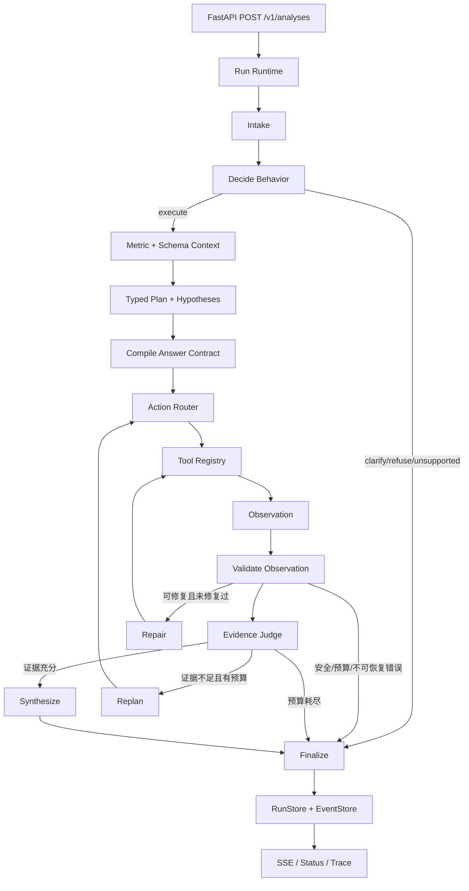

# 第三周：有界分析 Agent 与 FastAPI/SSE 设计

> 2026-09-07 收尾状态：第三周核心工程与离线验收已完成。本文保留原设计/实施步骤（包括当时的 live 授权边界和待执行复选框）；当前完成证据、已知问题、统一测评延期及本地集成状态以 [第三周交付记录](../../reports/week-3-closeout-2026-09-07.md) 为准。

- 日期：2026-09-04
- 状态：设计已批准并完成自检，实施计划已完成，等待执行
- 设计路径：Architectural
- 适用项目：`governed_analytics`

## 1. 背景

第一周建立了电商分析数据、指标目录、Golden Questions 与裸模型基线。第二周完成了 SQL 安全策略、四个受控分析工具、`core-v2` 和分层评测，并运行了一次 DeepSeek live 基线。

第二周固定基线为：

| 指标 | 结果 |
| --- | ---: |
| result accuracy | 37/50，74% |
| contract accuracy | 34/50，68% |
| valid/execute rate | 47/50，94% |
| strict accuracy | 30/50，60% |
| 本地静态安全 | 20/20 |

第二周仍是“一次模型调用生成 SQL，再由图外评测器打分”的裸流程。四个工具虽然已经实现，但尚未被模型通过 Agent 编排真实调用；项目也没有 Agent 图、任务运行时、FastAPI、SSE、RunStore 或 EventStore。

第三周要完成一个可控、可评测、可观测的端到端最小垂直切片，同时完整保留第一、二周的历史基线。

## 2. 目标

第三周交付一个“确定性外壳 + 有界自适应分析循环”的分析 Agent：

1. 支持现有 15 个简单指标查询。
2. 支持旗舰归因场景：比较两个明确时间窗口的 GMV，并分析区域、SKU、客户分群的贡献。
3. 由框架真实调用 Metric、Schema、Profile、Execute SQL 四个注册工具。
4. 用 TypedMetricPlan、AnswerContract 和 Evidence 约束模型行为与最终答案。
5. 最多允许一次确定性 Repair，并对迭代、工具、时间、行数和成本设置硬预算。
6. 提供 FastAPI 异步任务接口、SSE 事件流、状态查询和脱敏 Trace。
7. 建立独立的 Week3 离线评测协议；首次 Agent live 仅在用户另行明确授权后执行。

## 3. 非目标

第三周明确不实现：

- Web UI、图表、文件导出和交互式分析工作台。
- PostgreSQL checkpoint、服务重启恢复和分布式任务队列。
- 人工审批节点和审批后的同任务恢复。
- 同一个 run 内的多轮澄清；用户补充条件后创建新 run。
- 无边界的通用 ReAct、任意领域分析或任意数据库探索。
- pgvector、RAG 或通用指标语义检索。
- API 身份认证和面向公网的部署方案。
- 修改 Week1/Week2 裸模型适配器、固定 70 条协议或历史报告。
- 依赖升级。

Checkpoint、人工审批与重启恢复计划放到第五周。第三周 API 定位为本地或受控内网的能力验证接口。

## 4. 核心设计决策

| 主题 | 决策 |
| --- | --- |
| Agent 形态 | Typed-plan hybrid graph，不使用自由 ReAct |
| 自适应能力 | 在确定性边界内根据证据缺口重规划 |
| 简单指标范围 | 当前 15 个已注册指标 |
| 归因范围 | GMV 的区域、SKU、客户分群三维归因 |
| 行为路由 | `execute / clarify / refuse / unsupported` |
| 澄清方式 | 返回缺失字段并终止；补充信息创建新 run |
| 状态存储 | RunStore/EventStore 接口 + 内存实现 |
| 模型模式 | 默认 fixture；CI 使用 fake/scripted；live 由服务器配置显式开启 |
| Repair | 最多一次，只修确定性的结构或结果契约错误 |
| Oracle | 仅图外评测器可见，生产图完全不可见 |
| API | FastAPI 异步任务 + SSE |
| live 验收 | 首次结果为探索性基准，不作为第三周实现硬门禁 |

## 5. 总体架构



模型负责提出结构化行为决策、分析计划、下一动作和答案草稿。框架负责：

- 校验所有结构化输出。
- 选择并调用注册工具。
- 执行 SQL 安全策略。
- 维护调用预算、超时和任务状态。
- 判断失败是否允许 Repair。
- 校验证据是否满足最终答案门槛。
- 持久化脱敏事件和 Trace。

模型不能直接调用数据库，不能自行绕过 Tool Registry，也不能决定安全策略是否适用。

## 6. 核心契约

### 6.1 BehaviorDecision

行为决策包含：

- `action`：`execute | clarify | refuse | unsupported`。
- `reason_code`：稳定、可聚合的原因码。
- `missing_fields`：仅在 `clarify` 时返回需要补充的字段。
- `user_message`：面向用户的简短说明，不包含隐藏推理。

首批原因码至少覆盖：

- `ready`
- `missing_metric`
- `missing_time_window`
- `missing_comparison_window`
- `ambiguous_metric`
- `unsafe_request`
- `sensitive_data_request`
- `unsupported_analysis`
- `unsupported_data_domain`

`clarify`、`refuse` 和 `unsupported` 均直接进入终态，不调用数据库。

### 6.2 TypedMetricPlan

计划至少包含：

- 指标名称与版本。
- 分析类型：`simple | comparison | attribution`。
- 主时间窗口和比较时间窗口。
- 粒度、维度和过滤条件。
- 分子、分母及聚合语义。
- NULL、零分母和缺失桶处理规则。
- 排序、Top-K 和稳定 tie-break 规则。
- 待验证的 Hypothesis 列表。

计划修改采用追加 revision 的方式记录，旧版本不得被覆盖。

### 6.3 AnswerContract 与 ObservationContract

AnswerContract 与 MetricInfo 分离。它描述本次问题最终需要哪些证据和结果，而不是指标目录的静态定义。简单查询通常只有一个 ObservationContract；多步归因则为 GMV 比较、区域、SKU、客户分群分别编译子契约。

AnswerContract 包含：

- `answer_contract_id`。
- 必须完成的 hypothesis 和 evidence 类型。
- 以 `contract_id` 索引的 ObservationContract 集合。
- 完成、部分完成和前提不成立的判定规则。

每个 ObservationContract 描述一次动作的动态结果形状：

- `contract_id` 和对应的 `hypothesis_id`。
- 有序列名。
- 列类型、业务角色和可空性。
- 标量、单行、明细表或分组表等结果形态。
- 最小和最大基数。
- 唯一键或分组键。
- 排序方向、Top-K、limit 和稳定 tie-break。
- 截断是否允许。

### 6.4 AgentAction

每次动作是单个结构化对象：

- `action_type`：`metric_lookup | schema_lookup | profile | execute_sql`。
- `purpose`：简短用途说明。
- `arguments`：普通 JSON 参数，由适配器转换为内部严格 request。
- `hypothesis_id`：动作服务的假设，可为空。
- `contract_id`：该动作必须满足的 ObservationContract；纯上下文动作可为空。
- `expected_evidence`：预期形成的证据类型。

模型只能提出 AgentAction，不能直接执行 handler，也不能通过 `finish` 动作绕过 Evidence Judge。是否进入综合与终止只能由框架根据证据状态决定。

### 6.5 Observation 与 Evidence

Observation 记录一次工具调用的脱敏结果：

- tool 名称、调用状态和安全错误类别。
- `query_id`、列名、行数、是否截断。
- 契约校验结果和有限的统计摘要。
- 对应 hypothesis 与 evidence gap。

EvidenceItem 记录：

- 稳定 evidence ID。
- 支持或反驳的 hypothesis。
- 数值结论和单位。
- 来源 `query_id`。
- 验证状态和限制条件。

最终答案中的每个数值主张必须引用至少一个已验证 EvidenceItem。

### 6.6 RepairRecord 与 FinalAnswer

RepairRecord 保存首次候选、失败类别、修复动作和修复结果。首次候选必须永久保留，用于比较 `first_candidate` 与 `final_after_repair`。

FinalAnswer 包含：

- FinalStatus 和唯一 `stop_reason`。
- 面向用户的结论。
- 证据引用。
- 已完成与未完成的分析维度。
- 限制和证据缺口。
- 可选的结构化结果摘要。

不保存或输出模型隐藏推理过程。

## 7. AgentState

AgentState 按以下分组组织：

| 分组 | 字段 |
| --- | --- |
| Identity | `run_id`、原始 query、规范化 query、lifecycle status、final status |
| Behavior | BehaviorDecision |
| Context | metric context、schema context |
| Planning | plan revisions、hypotheses、next_action、AnswerContract、ObservationContracts |
| Execution | observations、evidence、evidence_gaps、first_candidate、repair_history |
| Governance | iteration、model/tool/execute/profile/repair counters、tokens、cost、deadline |
| Final | FinalAnswer、stop_reason |

状态更新遵循追加优先：Observation、Evidence、计划 revision 和 RepairRecord 不覆盖历史记录。生产状态不包含 expected SQL、expected rows、scorer 结果或其他 Oracle 信息。

## 8. 图节点与职责

### 8.1 Intake

- 校验 query 非空和长度边界。
- 生成或接收 runtime 分配的 run ID。
- 规范化空白等非语义格式，不重写业务含义。

### 8.2 DecideBehavior

- 生成 BehaviorDecision。
- 对缺少指标或时间条件的问题返回 `clarify`。
- 对危险或敏感请求返回 `refuse`。
- 对第三周范围外的分析返回 `unsupported`。

### 8.3 RetrieveContext

- 使用轻量的 15 指标索引定位候选指标。
- 通过 MetricTool 和 SchemaTool 获取权威上下文。
- 第三周不引入向量检索。

### 8.4 BuildPlan 与 CompileContract

- BuildPlan 生成 TypedMetricPlan 和初始 Hypothesis。
- CompileContract 从计划和指标定义生成 AnswerContract，并为每个分析动作生成独立 ObservationContract。
- 合约编译失败视为计划失败，不进入 SQL 执行。

### 8.5 RouteAction 与 InvokeTool

- RouteAction 只能产生注册表允许的 AgentAction。
- InvokeTool 检查节点权限、预算、参数适配、安全级别，再调用 handler。
- handler 返回值先由 sanitizer 处理，再进入 State、EventStore 和 Trace。

### 8.6 ValidateObservation

ValidateObservation 按 AgentAction 引用的 `contract_id` 选择对应 ObservationContract，并校验：

- 工具调用是否成功。
- SQL 是否通过安全策略并完成执行。
- 列名、类型、形状、基数和排序是否满足 AnswerContract。
- 是否截断以及 NULL/零分母规则是否得到处理。
- Observation 是否可形成可引用证据。

生产 ValidateObservation 只验证契约和执行事实，不判断 Oracle 语义正确率。

### 8.7 JudgeEvidence

- 判断当前证据是否足以回答。
- 维护已解决和未解决的 evidence gap。
- 证据不足且预算允许时进入 Replan。
- 证据充分时进入 Synthesize。

### 8.8 Replan、Repair、Synthesize 与 Finalize

- Replan 只处理证据不足，选择下一个 hypothesis 或维度。
- Repair 只处理确定性、可修复的结构输出或结果契约错误。
- Synthesize 只能引用已验证 EvidenceItem。
- Finalize 生成唯一终态、唯一 stop_reason 和唯一 terminal SSE 事件。

## 9. 简单查询与旗舰归因

### 9.1 简单指标

正常路径为：行为判断 → 指标/Schema 上下文 → 计划/契约 → Execute → 校验 → 综合。

完成门槛：

1. 指标和时间范围明确。
2. SQL 通过策略并成功执行。
3. 结果满足 AnswerContract。
4. 有可引用的 `query_id` 和 EvidenceItem。
5. 没有未处理的截断、NULL 或零分母问题。

### 9.2 GMV 归因

旗舰路径按证据动态决定顺序，但最多包含四次分析 Execute：

1. 比较两个窗口，确认 GMV 是否下降。
2. 分析区域贡献。
3. 分析 SKU 贡献。
4. 分析客户分群贡献。

如果比较结果表明 GMV 没有下降，则“前提不成立”本身是完整答案，不强行执行三个归因维度。

如果确认下降：

- 三个维度均完成且证据有效，状态为 `completed`。
- 只完成一至两个维度但已有可用证据，状态为 `partial`，必须明确缺失维度。
- 仅确认下降、尚无任何归因维度证据时，不得生成归因结论。

## 10. Tool Registry

每个 ToolDefinition 包含：

- `name`
- `input_schema`
- `risk_level`
- `argument_adapter`
- `handler`
- `result_sanitizer`
- `allowed_nodes`
- `budget_cost`

参数适配器负责把模型普通 JSON 转换为第二周严格的 Pydantic request，例如把 JSON list 转为内部 tuple、把 ISO 字符串转为日期时间。不得为适配模型而放宽第二周内部契约。

ExecuteSqlTool 支持注入由 FastAPI lifespan 管理的共享数据库执行后端，同时保留当前默认构造和每次调用生命周期，确保现有测试与裸评测兼容。

共享执行后端必须继续使用现有 `analytics_readonly` 数据库角色，不得因 Agent 或 API 装配切换到迁移、所有者或其他高权限角色。

SQL policy 的内部细粒度原因映射为安全、稳定、不会泄露 SQL 的诊断类别；SSE 和 Trace 不输出原始数据库错误或 SQL 参数。

## 11. Model 边界与运行模式

现有 `OpenAICompatibleSqlGenerator` 保持冻结。第三周新增独立 AgentModel port 和 OpenAI-compatible 实现，用于 DeepSeek 的结构化行为、计划、动作和综合调用。

运行模式由服务器配置决定：

- `fixture`：FastAPI 默认模式，使用确定性模型实现。
- `fake/scripted`：CI 和离线评测模式。
- `live`：只有服务器环境显式设置 `AGENT_LIVE_ENABLED=true` 才可启用。

HTTP 请求体不得指定或切换 runtime mode、模型 endpoint 或 API key。首次 live 执行还需要用户在运行前另行明确授权。

所有模型调用：

- 计入 LLM call、token 和成本预算。
- 记录安全的 model ID、延迟和 `finish_reason`。
- 关闭 SDK 自动重试：`max_retries=0`。
- 不保存 provider raw response、完整 prompt 或隐藏推理。

所有产生结构化模型输出的节点统一通过 StructuredModelInvoker 调用。该包装器执行 schema 校验、预算记账和全 run 共享的一次结构修复；Behavior、Plan、Action、Synthesis 的解析错误不会各自获得独立重试额度。

LLM 调用上限按以下方式闭合：

| 用途 | 最多调用数 |
| --- | ---: |
| BehaviorDecision | 1 |
| BuildPlan | 1 |
| RouteAction，包含 Replan 后的下一动作 | 4 |
| Synthesize | 1 |
| 全 run 共享 Repair | 1 |
| 合计 | 8 |

RetrieveContext 中的 Metric/Schema 调用由框架确定性触发，不额外调用模型。Replan 根据已有计划中的未解决 hypothesis 和 evidence gap 确定性选择下一目标，再由下一次 RouteAction 生成动作；Replan 本身不调用模型。若 RouteAction 选择 Profile，该次选择仍消耗一个 RouteAction 调用额度。

Finalize 必须是确定性的：即使没有剩余 LLM 调用或成本不足以执行 Synthesize，也必须基于已验证证据和模板生成合法终态，不能因为缺少最后一次模型调用而悬挂任务。

live 模式必须找到匹配的本地 pricing snapshot，才能在调用前预留成本；缺少价格信息时 fail closed。

## 12. 预算与停止规则

| 预算项 | 上限 |
| --- | ---: |
| 分析 action loop | 4 |
| LLM calls | 8 |
| 全部工具调用 | 12 |
| Execute SQL | 5，含可能的一次 Repair |
| Profile | 2 |
| Repair | 1 |
| 单次 SQL 超时 | 10 秒 |
| 整个任务超时 | 60 秒 |
| 结果行数 | 500 |
| 成本 soft cap | ¥0.20 |
| 成本 hard cap | ¥0.30 |
| 同时运行任务 | 2 |

每次非 Repair 的候选分析 Execute 在经过 ValidateObservation 和 Evidence Judge 后都递增 action loop，无论执行或校验成功与否。Metric、Schema、Profile 等上下文工具计入工具调用预算，但不消耗分析 loop；Repair Execute 计入 Execute 和 Repair 预算，不新开 hypothesis。

每次 LLM 调用前，BudgetPort 必须按该调用的最坏估计成本进行预留。预留后可能超过 hard cap 时，不得发起调用。完成后按实际用量结算并释放差额。

达到 soft cap 后：

- 不再创建新 hypothesis。
- 不再调用 Profile。
- 使用已有证据尝试综合答案。
- 发出 `budget.warning`。

达到 hard cost cap、调用数、工具数、Execute 数或 action loop 等资源预算后：

- 立即停止新调用。
- 保留已有 Observation 和 Evidence。
- 有足够最低证据时返回 `partial`。
- 没有最低证据时返回 `budget_exhausted`。

达到 SQL 或整个任务的时间上限时同样停止新调用，但无最低证据时返回 `execution_failed`，stop_reason 分别为 `sql_timeout` 或 `task_timeout`；有最低证据时返回 `partial`。时间上限不映射为 `budget_exhausted`。

## 13. Replan 与 Repair

Replan 与 Repair 严格分离。StructuredModelInvoker 处理所有模型结构输出的修复；图中的 Repair 节点处理执行后结果契约修复。两条路径共享 AgentState 中唯一的一次 Repair 额度：

| 情况 | 处理 |
| --- | --- |
| 证据不足、仍有预算 | Replan |
| Behavior、Plan、Action 或 Synthesis 结构输出不可解析 | StructuredModelInvoker 允许一次 Repair |
| 执行后列名、顺序或形状不匹配 | 允许一次 Repair |
| SQL policy rejection | 禁止 Repair |
| 敏感字段或敏感结果 | 禁止 Repair |
| `refuse` / `unsupported` | 禁止 Repair |
| 预算或任务超时 | 禁止 Repair |
| 数据库 timeout、结果截断或未知错误 | 禁止 Repair |
| Oracle 分数不正确 | 生产图不可见，禁止据此 Repair |

若 Repair 产生新 SQL，该 SQL 必须重新通过完整安全策略。第二次可修复失败也不得再次 Repair，必须进入确定终态。Synthesis 结构修复仍失败时，Finalize 使用确定性模板输出现有证据与限制。

## 14. 生命周期、终态与错误语义

运行生命周期与最终业务结果分开表示：

- `RunLifecycleStatus`：`queued | running | terminal`。
- `FinalStatus`：只在 lifecycle 为 `terminal` 时存在。

FinalStatus 枚举：

- `completed`
- `partial`
- `clarification_required`
- `refused`
- `unsupported`
- `budget_exhausted`
- `policy_blocked`
- `model_unavailable`
- `execution_failed`
- `internal_error`

每个 run 在正常进程生命周期内必须只经历一次 `queued → running → terminal`，并恰好产生一个 FinalStatus、一个稳定 stop_reason 和一个 terminal SSE 事件。60 秒任务超时从任务由 `queued` 转为 `running` 时开始计算，不包含排队时间。

stop_reason 是闭集，首版包含：

- 正常完成：`answer_complete`、`premise_not_met`、`evidence_partial`。
- 澄清与范围：`missing_required_fields`、`unsupported_analysis`、`unsupported_data_domain`。
- 安全：`unsafe_request`、`sensitive_data_request`、`sql_policy_rejected`、`sensitive_result_blocked`。
- 预算：`cost_soft_cap`、`cost_hard_cap`、`llm_call_limit`、`tool_call_limit`、`execute_limit`、`profile_limit`、`analysis_loop_limit`。
- 超时与执行：`sql_timeout`、`task_timeout`、`result_truncated`、`database_error`。
- 模型与结构：`model_unavailable`、`structured_output_invalid`、`plan_invalid`、`answer_contract_unmet`、`repair_failed`。
- 系统：`internal_error`。

新增 stop_reason 必须同步更新 API schema、报告聚合和测试，不能在运行时临时生成自由文本原因码。

关键映射：

- 行为层危险请求 → `refused`。
- 执行阶段 SQL 策略拒绝 → `policy_blocked`。
- hard cap 且有最低证据 → `partial`；无最低证据 → `budget_exhausted`。
- SQL 或任务超时且有最低证据 → `partial`；无最低证据 → `execution_failed`。
- 结果截断且有其他最低证据 → `partial`；否则 → `execution_failed`。
- 结构 Repair 仍失败或计划无法形成 → `execution_failed`。
- provider 不可用且无法形成答案 → `model_unavailable`。
- 未分类异常 → `internal_error`，对外只给稳定错误码。

## 15. FastAPI 接口

### 15.1 `POST /v1/analyses`

- 接收用户 query。
- 成功创建任务返回 `202 Accepted`。
- 响应包含 `run_id`、初始 lifecycle status `queued`、status URL、events URL 和 trace URL。
- 容量达到 100 个未清理任务时返回 `503`，不覆盖旧任务。

### 15.2 `GET /v1/analyses/{run_id}`

- 返回当前 lifecycle status；进入 `terminal` 后同时返回 FinalStatus、终态答案或安全错误摘要。
- 不返回原始模型响应、SQL 参数或原始数据库行。

### 15.3 `GET /v1/analyses/{run_id}/events`

- 返回 `text/event-stream`。
- 支持 `Last-Event-ID` 重放。
- 客户端断开不取消后台 Agent。

### 15.4 `GET /v1/analyses/{run_id}/trace`

- 返回脱敏后的节点、工具、预算和证据轨迹。
- 第三周不返回完整 SQL。

### 15.5 健康检查

- `GET /healthz`：进程存活。
- `GET /readyz`：核心依赖和运行时装配可用。

应用使用 FastAPI lifespan 创建和关闭共享数据库执行后端，不使用已弃用的 startup/shutdown 回调。

## 16. RunStore、EventStore 与 SSE

RunStore 和 EventStore 先定义接口，再提供内存实现：

- 最多保留 100 个尚未清理的 queued、running 或 terminal 任务。
- terminal 任务从终态时间起保留 1 小时后可清理。
- 最多 2 个任务同时运行，其余任务在容量内等待。
- 服务重启后不恢复任务。
- run ID 不可覆盖。

SSE envelope：

- `event_id`：`<run_id>:<sequence>`。
- SSE 协议的 `id:` 字段必须与 envelope 中的 `event_id` 完全相同。
- `sequence`：run 内严格单调递增。
- `run_id`
- `timestamp`
- `node`
- `type`
- `data`

事件类型至少包括：

- `run.created`
- `run.started`
- `behavior.decided`
- `context.retrieved`
- `plan.created`
- `hypothesis.updated`
- `tool.started`
- `tool.completed`
- `tool.failed`
- `observation.validated`
- `evidence.assessed`
- `repair.started`
- `repair.completed`
- `budget.warning`
- `run.terminal`

重放语义固定如下：

- 不提供 `Last-Event-ID` 时，从该 run 的第一条保留事件开始重放，然后进入实时订阅。
- 提供合法 cursor 时，只发送 `sequence` 严格大于 cursor 的事件。
- cursor 格式非法或指向其他 run 时返回 `400`；run 不存在时返回 `404`；cursor 超过当前 high-water mark 时返回 `409 event_cursor_ahead`。
- EventStore 必须原子地完成“读取 high-water mark、取得重放区间、注册实时订阅”，保证历史到实时切换无丢失、无重复。
- 发出 `run.terminal` 后关闭当前 SSE 流；在保留期内重新连接仍可重放完整历史。

15 秒 heartbeat 是 transport-only，不进入 EventStore、不占用 sequence。一个 run 在正常进程生命周期内只能持久化一次 `run.terminal`。突然进程退出可能使内存中的 run 和事件全部丢失；第三周不声称在进程崩溃时仍能补写 terminal event，这与“不支持重启恢复”的范围一致。

## 17. Trace 与脱敏

Trace 可以包含：

- 节点开始、结束与耗时。
- tool 名称、purpose 和经过白名单处理的参数摘要。
- `query_id`、列名、行数、截断状态。
- evidence gap、Repair 次数和结果。
- 模型调用次数、token、成本、`finish_reason`。
- stop_reason。

Trace、SSE 和日志禁止包含：

- provider raw response。
- 隐藏 chain-of-thought。
- 完整系统或用户 prompt。
- API key、数据库密码和 endpoint。
- SQL 参数、原始数据库错误。
- 完整 SQL 和原始结果行。
- Oracle、expected rows 或 expected SQL。

## 18. 模块与依赖边界

```text
API → Runtime → Agent → Metrics / Tools / Safety / Persistence
                         ↑
                    Model Adapter

Evals → Agent/Runtime 公开接口
生产代码不得依赖 Evals
```

新增模块：

```text
src/governed_analytics/
├── agent/
│   ├── contracts.py
│   ├── state.py
│   ├── ports.py
│   ├── tool_registry.py
│   ├── validation.py
│   ├── graph.py
│   └── nodes/
│       ├── behavior.py
│       ├── planning.py
│       ├── execution.py
│       └── synthesis.py
├── runtime/
│   ├── budgets.py
│   ├── events.py
│   └── runs.py
├── api/
│   ├── contracts.py
│   ├── dependencies.py
│   ├── routes.py
│   └── app.py
├── models/
│   └── agent_openai_compatible.py
└── evals/
    └── week3/
        ├── models.py
        ├── suites.py
        ├── runner.py
        ├── scorers.py
        ├── reporting.py
        └── cli.py
```

Agent 通过 `ports.py` 中的抽象使用 Model、Budget 和 Event 能力，不依赖 FastAPI 或内存存储实现。Evals 只从公开接口驱动 Agent，不向生产状态注入 Oracle。

## 19. Week3 测试与评测

### 19.1 协议隔离

Week2 固定 70 条用例、case ID、expected data、scorer、manifest hash 和历史报告目录均保持只读。

Week3 使用独立的：

- case ID 和 schema。
- registry 与 manifest hash。
- `protocol_version`。
- 数据集和报告目录。
- runner、scorer 和 reporting。

每次运行记录 runtime mode、model、配置摘要和 protocol version。

### 19.2 分层测试

1. 单元测试：行为路由、参数适配、AnswerContract、Evidence Judge、预算预留和终态映射。
2. 端到端离线测试：scripted/fake model + 真实 Tool Registry + 真实 fixture 数据库。
3. API/SSE 测试：异步状态、sequence、重放、断线、唯一 terminal 和脱敏。
4. 回归测试：Week1/Week2 全部测试及静态安全。
5. 经单独授权后的 Agent live：生成探索性对照报告。

### 19.3 离线用例

- Behavior 10 条：4 条 clarify、2 条 execute control、2 条 refuse、2 条 unsupported。
- 简单指标 15 条：每个现有指标至少一条。
- 旗舰归因：至少一个确定存在 GMV 下滑的完整场景。
- Repair：首次失败后一次修复成功；修复后仍失败并确定终止。
- 预算：soft cap、hard cap、调用前预留、任务 timeout。
- 策略：policy block 后不执行 Repair。
- 设计冻结后新增至少 10 条 held-out 改写用例。

### 19.4 指标

不得合并为单一“准确率”。分别报告：

- `first_candidate` 与 `final_after_repair`。
- result、contract、strict。
- valid SQL / execute rate。
- 工具选择与参数正确率。
- 多步任务成功率和证据充分率。
- 静态 SQL 安全与自然语言拒绝。
- fixture 与 live。
- known regression 与 held-out。

## 20. 验收门槛

第三周实现验收必须同时满足：

1. 现有单元、集成测试、lint 和类型检查全部通过。
2. Week2 协议 hash 不变，旧基线无回归。
3. Behavior 10/10；所有非 execute 用例为零数据库调用、零 Execute SQL。
4. fixture 上 15 个简单指标 15/15 满足结果、AnswerContract 和执行门槛。
5. 旗舰场景先确认下滑，再完成区域、SKU、客户分群；每项结论绑定数值证据和 `query_id`。
6. Repair 永不超过一次，首次候选保留，第二次失败确定终止。
7. Week2 静态安全保持 20/20；policy rejection 不触达数据库，敏感请求不产生 Execute action，二者均不 Repair。
8. 所有预算边界生效，可能越过 hard cap 的调用不会发出。
9. SSE sequence 单调、Last-Event-ID 精确重放、断线不取消、每个 run 恰好一个 terminal event。
10. Trace、SSE 和日志通过凭证、Prompt、SQL 参数、原始行和 Oracle 泄漏检查。

## 21. Live 策略与报告

第三周离线门禁全部通过后，才向用户请求一次独立、明确的 DeepSeek Agent live 授权。授权只覆盖约定的一次运行，不自动扩大为持续 live 权限。

首次 live 报告与第二周兼容业务子集对照：

- result 74%。
- contract 68%。
- strict 60%。
- valid/execute 94%。

首次结果只作观察，不事后修改第三周验收线。报告冻结后，再根据真实失败类别制定第四周量化改进目标。安全、预算、脱敏和终态完整性仍是 live 的硬门禁。

上述 Week2 数值是冻结的历史参考。第三周回归验收只校验固定协议、hash、测试和已有报告，不重新发起任何付费 Week2 live 调用。

## 22. 风险与缓解

| 风险 | 缓解措施 |
| --- | --- |
| 模型输出波动 | 结构化契约、fake/scripted 门禁、最多一次 Repair |
| 模型绕过工具 | AgentAction + Tool Registry，由框架唯一执行 |
| 工具参数不兼容 | JSON argument adapter，不放宽内部契约 |
| SQL 或敏感数据风险 | 完整 SQL policy、只读角色、禁止策略失败 Repair |
| 多步归因失控 | 旗舰场景限定、四轮分析、证据门槛和预算停止 |
| 成本超限 | 调用前最坏成本预留、soft/hard cap、SDK 不自动重试 |
| SSE/Trace 泄密 | sanitizer、白名单字段、专门泄漏测试 |
| 内存任务丢失 | 明确第三周不承诺重启恢复，第五周引入 checkpoint |
| 旧基线被污染 | 冻结旧 adapter、固定 70 条协议和 hash 回归门禁 |

## 23. 交付边界

本设计批准后，下一步仅生成一个主实施计划。该计划必须划分为三个带独立验证检查点的阶段：Agent 核心、Runtime/API、Week3 eval；不能把所有模块作为一个无检查点的大批次实现。

实施计划获批后，才能进入 TDD 实现。任何付费 DeepSeek Agent live 调用都不属于该离线实施计划，并且需要在全部离线门禁通过后再次取得用户明确授权。
